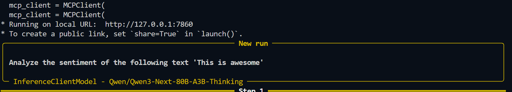

# [Gradio as an MCP Client](https://huggingface.co/learn/mcp-course/unit2/gradio-client#gradio-as-an-mcp-client)

## Start the Client
1. `py client.py`
2. View the prompt and response in the terminal:


## Quickstart (python)

1. Connect to an MCP Server from Gradio:
    ```python
    from smolagents.mcp_client import MCPClient

    with MCPClient(
        {"url": "https://abidlabs-mcp-tool-http.hf.space/gradio_api/mcp/sse", "transport": "sse",}
    ) as tools:
        # Tools from the remote server are available
        print("\n".join(f"{t.name}: {t.description}" for t in tools))
    ```
2. Install the smolagents, Gradio and mcp-client libraries:
    `pip install "smolagents[mcp]" "gradio[mcp]" mcp fastmcp`
3. Create a simple Gradio interface that uses the MCP Client to connect to the MCP Server:

    ```python
    import gradio as gr
    import os

    from mcp import StdioServerParameters
    from smolagents import InferenceClientModel, CodeAgent, ToolCollection, MCPClient
    ```

4. Connect to the MCP Server and get the tools that we can use to answer questions:

    ```python
    mcp_client = MCPClient(
      {
        "url": "https://abidlabs-mcp-tool-http.hf.space/gradio_api/mcp/sse",
        "transport": "sse",
      }
    ) 
    tools = mcp_client.get_tools()
    ```
5. Create a simple agent that uses the MCP Server tools to answer questions. For demo, use the simple `InferenceClientModel` and the default model from `smolagents`. Pass your api_key to the InferenceClientModel.

    ```python
    model = InferenceClientModel(token=os.getenv("HF_TOKEN"))
    agent = CodeAgent(tools=[*tools], model=model)
    ```
6. Create a simple Gradio interface that uses the agent to answer questions:

    ```python
    demo = gr.ChatInterface(
        fn=lambda message, history: str(agent.run(message)),
        type="messages",
        examples=["Prime factorization of 68"],
        title="Agent with MCP Tools",
        description="This is a simple agent that uses MCP tools to answer questions."
    )

    demo.launch()
    ```
---
### **RESULT**: *A simple Gradio interface that uses the MCP Client to connect to the MCP Server and answer questions.*
---

7. [Deploy - Quick steps to add a Hugging Face remote and push your branch.](https://huggingface.co/learn/mcp-course/unit2/gradio-client#deploying-to-hugging-face-spaces)

    **Steps**
    - **Create repo:** Create a new repo on Hugging Face (https://huggingface.co/new) and copy its Git URL.
    - **Add remote:** Add the HF URL as a new remote (name it `hf` or whatever you prefer).
    - **Verify & push:** Verify remotes and push your branch (use your current branch name).
    - **Optional LFS:** Enable Git LFS if you have large model files.

    Commands (run in [`../../../../../../C:/Users/obd1/repos/mcp/python-uv-mcp`](../../../../../../C:/Users/obd1/repos/mcp/python-uv-mcp )):
    ```powershell
    git remote -v
    git remote add hf https://huggingface.co/<your-username>/<repo>.git
    git remote -v
    git branch --show-current
    git push -u hf <current-branch>
    git push hf --tags
    ```

    Notes
    - If Hugging Face requires a token, prefer your OS credential helper; avoid embedding tokens in URLs. Example (less secure):
    ```powershell
    git remote add hf https://<HF_TOKEN>@huggingface.co/<user>/<repo>.git
    ```
    - For large files (models): 
    ```powershell
    git lfs install
    git lfs track "*.bin"
    git add .gitattributes
    git add <large-files> && git commit -m "Add large files"
    git push -u hf <current-branch>
    ```

---
## More on InferenceClientModel & CodeAgent

`InferenceClientModel` is the **model adapter** that lets a `CodeAgent` talk to a large language model served through the **Hugging Face Inference API**. In short, it’s the bridge between your agent logic and a remote LLM.

### What the `InferenceClientModel` class is for

Its job is to:

* Authenticate with Hugging Face (using `HF_TOKEN`)
* Send prompts to a hosted model (e.g. LLaMA, Mistral, Qwen, etc.)
* Receive and normalize the model’s responses
* Expose a **standard interface** that agents (like `CodeAgent`) can rely on, regardless of which underlying model is used

This abstraction allows the agent framework to stay model-agnostic.

---

### What capabilities it gives the agent

When you pass `InferenceClientModel` into `CodeAgent`, the agent gains the ability to:

#### 1. **Natural language reasoning**

The agent can:

* Understand instructions
* Plan multi-step solutions
* Decide *when* to call tools vs. when to think or respond

This is the “brain” of the agent.

#### 2. **Tool calling (critical for agents)**

The model can:

* Decide which tool to call
* Generate structured arguments for that tool
* Interpret tool results and continue reasoning

Example flow:

```
User question → model reasoning → tool call → tool output → model reasoning → final answer
```

Without a model like this, the agent would have no decision-making ability.

#### 3. **Code generation and execution planning**

Because it’s paired with `CodeAgent`, the model can:

* Write Python code
* Decide when code execution is needed
* Inspect results and fix errors iteratively

This enables autonomous coding behavior.

#### 4. **Model-hosted inference (no local GPU needed)**

Using `InferenceClientModel` means:

* No local model loading
* No GPU/VRAM requirements
* Easy switching between models by changing configuration

The heavy lifting happens on Hugging Face’s servers.

#### 5. **Streaming and structured outputs (model-dependent)**

Depending on the backend model, it may support:

* Token streaming
* JSON / structured outputs
* Function-call–style responses

The agent framework uses these features to stay robust and predictable.

---

### How it fits together conceptually

```text
CodeAgent
   │
   ▼
InferenceClientModel
   │
   ▼
Hugging Face Inference API
   │
   ▼
Large Language Model
```

So:

* **`CodeAgent`** = behavior, planning, tool orchestration
* **`InferenceClientModel`** = communication + reasoning engine
* **LLM** = intelligence that drives decisions

---

### One-sentence summary

`InferenceClientModel` provides the agent with **remote LLM-powered reasoning, tool selection, and code-generation capabilities**, acting as the standardized interface between the agent and Hugging Face–hosted models.

If you want, I can also explain:

* how this differs from a local `TransformersModel`
* which HF models work best with `CodeAgent`
* or how tool-calling is implemented under the hood
