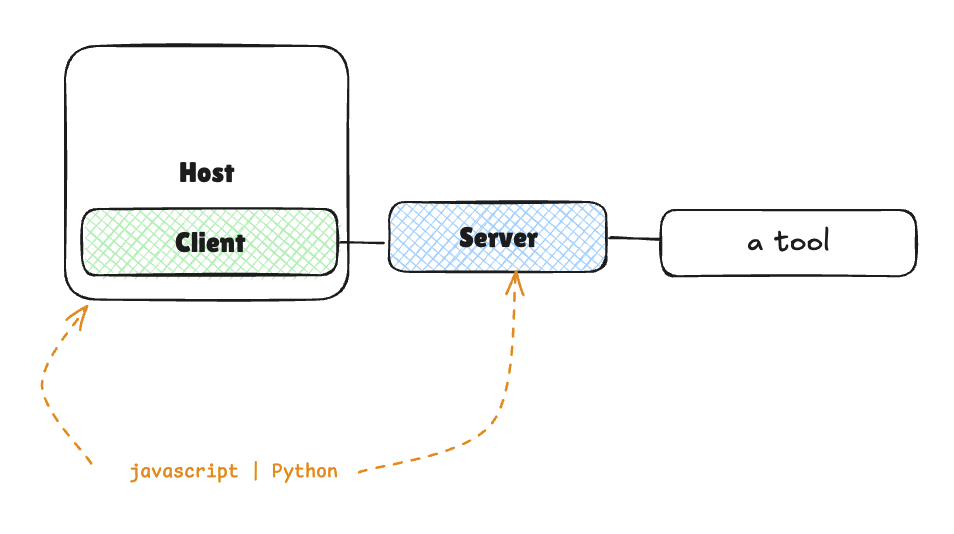

# [Building an End-to-End MCP Application](https://huggingface.co/learn/mcp-course/unit2/introduction)

## Create & Use custom MCP server with Gradio

Custom MCP servers with Gradio can be [deployed](https://huggingface.co/learn/mcp-course/unit2/gradio-server#deploying-to-hugging-face-spaces) to a remote like [Hugging Face Spaces](huggingface.co/spaces) which will auto-build and host your MCP server. Only needs a file named `app.py` and `requirements.txt` to transform your functions into MCP tools.

  *Hugging Face Spaces work similarly to GitHub repos.*

Once deployed, your custom MCP server is available at `https://YOUR_USERNAME-mcp-sentiment.hf.space/gradio_api/mcp/sse` and ready for use.

Add your custom MCP to your `mcp.json` and click "Start the server" option above the MCP server's name. In Copilot Chat, open `Configure Tools...` and the custom MCP server will be listed along with any tools.

Reference the tool in Copilot Chat: `#mcp_sentiment_sentiment_analysis`. 

Tool naming convention: `<Hugging-Face-Space-Name>_<function-name>`.

### Example:
*MCP built for this project: https://huggingface.co/spaces/tungkhuam/mcp-sentiment*

1. User enters Prompt:
    
    `#mcp_sentiment_sentiment_analysis` Lacks a good electronic reproduction so if thats what you need then this is not for you unless you use chorus. It is light and easy to play so again its a good acoustical guitar especially in this price range. I compared it to a Taylor Baby e and Martins small guitar e. This Yamaha has fuller sound.

2. Copilot captures user input and uses mcp_sentiment_sentiment_anlaysis tool to provide a sentiment analysis:

    **Input**

      ```json
      {
        "text": "Lacks a good electronic reproduction so if thats what you need then this is not for you unless you use chorus. It is light and easy to play so again its a good acoustical guitar especially in this price range. I compared it to a Taylor Baby e and Martins small guitar e. This Yamaha has fuller sound."
      }
      ```

      **Output**

      ```json
      {"polarity": 0.34, "subjectivity": 1, "assessment": "positive"}
      ```

Copilot's adds its enhancement to the sentiment tool's response:
>Sentiment analysis result:
> - Polarity: 0.34 (slightly positive)
> - Subjectivity: 1 (very subjective)
> - Assessment: positive
>
> This review is overall positive and highly subjective, focusing on personal impressions of the guitar.


## Overview
Build a **sentiment analysis application** that consists of three main parts: the ***server***, the ***client***, and the ***deployment***.

### Server Side
- Uses Gradio to create a web interface and MCP server via gr.Interface
- Implements a sentiment analysis tool using TextBlob
- Exposes the tool through both HTTP and MCP protocols

### Client Side
- Implements a HuggingFace.js client
- Or, creates a smolagents Python client
- Demonstrates how to use the same server with different client implementations

### Deployment
- Deploys the server to Hugging Face Spaces
- Configures the clients to work with the deployed server

### Architecture


---

## What You’ll Learn
**Objective**: A working MCP application that demonstrates the power and flexibility of the protocol

In this unit, you will:

- Create an MCP Server using Gradio’s built-in MCP support
- Build a sentiment analysis tool that can be used by AI models
- Connect to the server using different client implementations:
  - A HuggingFace.js-based client
  - A SmolAgents-based client for Python
- Deploy your MCP Server to Hugging Face Spaces
- Test and debug the complete system

## Prerequisites

Before proceeding with this unit, make sure you:

- Have completed Unit 1 or have a basic understanding of MCP concepts
- Are comfortable with both Python and JavaScript/TypeScript
- Have a basic understanding of APIs and client-server architecture
- Have a development environment with:
    - Python 3.10+
    - Node.js 18+
- A Hugging Face account (for deployment)